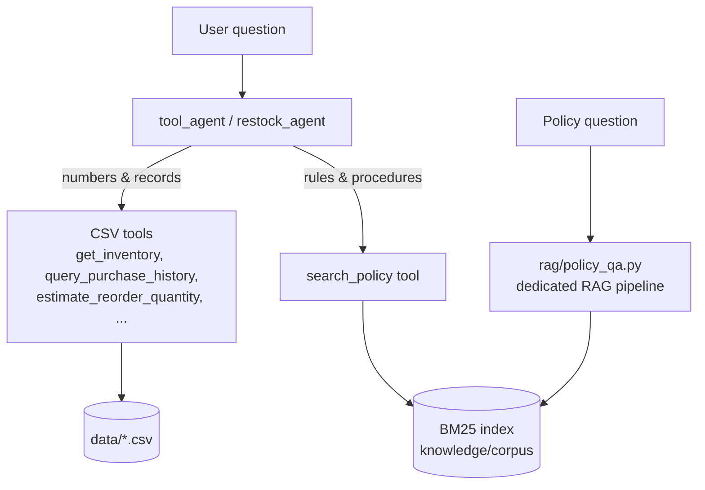

# RAG Architecture — Week 3

Owner: Mwesigwa Arnold Mugahi (AI Engineering Lead) · 2026-10-06 · Plain-language version: `docs/notes/rag-explained.md`

## Pipeline

```mermaid
flowchart LR
    subgraph OFFLINE["Ingestion (runs once per process, ~ms)"]
        C[(knowledge/corpus<br/>12 synthetic docs)] --> I[INGEST<br/>read .md]
        I --> CH[CHUNK<br/>split at ## headings<br/>120-word windows, 30 overlap<br/>skip disclaimer lines]
        CH --> IX[INDEX<br/>BM25 stats<br/>61 chunks]
    end

    Q[Question] --> R[RETRIEVE<br/>top-3, MIN_SCORE 2.0<br/>+ next section]
    IX --> R
    R -->|no chunk above MIN_SCORE| NF["'That information is not in the<br/>provided documents.' (no model call)"]
    R -->|chunks| A[AUGMENT<br/>[S1]..[Sn] context<br/>+ question]
    P[prompts/policy_qa_v1.0.0.md] --> G
    A --> G[GENERATE<br/>Gemini via fallback chain<br/>answer + citations]
    G --> CK[CHECK<br/>citations exist?<br/>factual answer cited?]
    CK --> OUT[Answer + sources]
    CK --> TR[(evidence/week3/<br/>rag_traces.jsonl)]
```

## Hybrid knowledge in the whole system



## Design choices

| Choice | Value | Why |
|:---|:---|:---|
| Corpus | 12 team-written synthetic documents | Brief: 10–50 documents, authorised data; consistent with the CSVs |
| Chunking | section-level (`##`), 120-word windows with 30-word overlap if longer | Sections are single topics; IDs like `POL-01#approval-thresholds` are human-checkable |
| Retrieval | BM25 (k1 1.5, b 0.75), heading words ×2, light stemmer | No extra dependency or quota, deterministic, explainable; adequate at 61 chunks |
| top-k | 3 + next section of each hit | R-2: answers often sit in the section after the matching heading |
| Unanswerable gate | best score < 2.0 → fixed refusal without a model call | Cheapest possible hallucination prevention |
| Prompt | answer only from sources, cite `[S#]`, state missing parts, fixed refusal | Grounding + honest partial answers |
| Output check | `check_citations()` | Model citations are verified, not trusted |
| Observability | `evidence/week3/rag_traces.jsonl` | Retrieved chunk IDs/scores and model per question |

## Known limits

- Keyword search misses synonyms and numeric ranges (R-4); embedding search is future work.
- The index is rebuilt in memory each run (fine at this size; persist it if the corpus grows).
