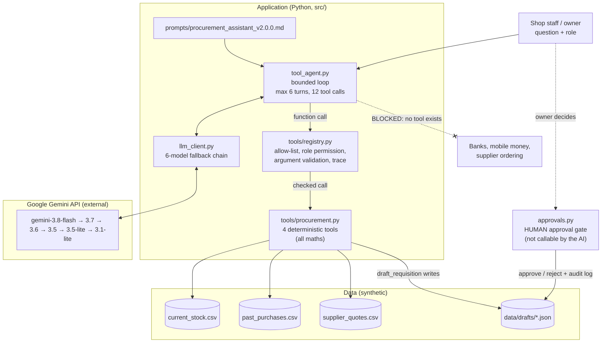
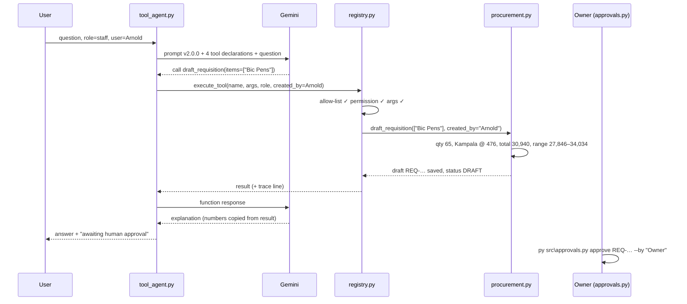

# Architecture — Week 4 (Tools and Function Calling)

Owner: Mwesigwa Arnold Mugahi (AI Engineering Lead) · Updated 2026-10-02

The diagrams use Mermaid; GitHub renders them automatically.

## Component view

## Sequence: "Draft a requisition for Bic Pens"

## What changed since Week 2

| Week 2 (context mode) | Week 4 (tool mode) |
|:---|:---|
| CSV text pasted into the prompt | Model sees no CSV text; tools read the files |
| Model computed quantities and totals (F-04: wrong numbers) | Python computes everything; model explains |
| Business rules only in the prompt | Business rules in `procurement.py`; prompt says when to use tools |
| Safety relied on the prompt | Allow-list + role permissions + validation in code; prompt is a second layer |
| No approval mechanism | `approvals.py` human gate with audit log |

`src/ai_engine.py` + prompt v1.2.0 (context mode) still work and remain the Week 2 baseline.
