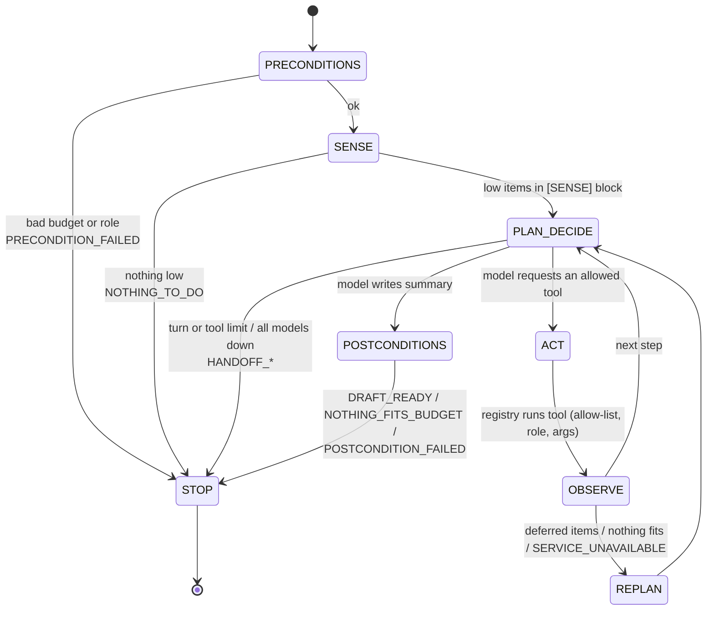
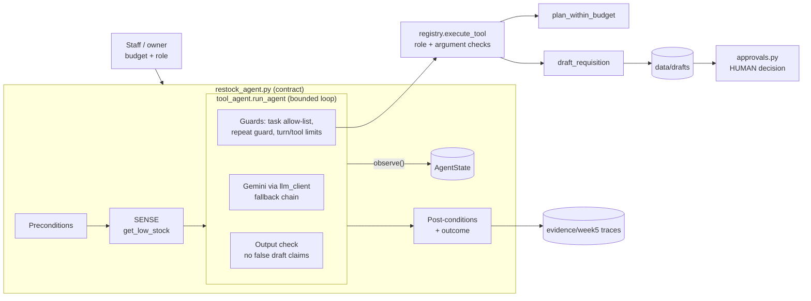

# Agent Architecture — Week 5 (Bounded Weekly Restock Agent)

Owner: Mwesigwa Arnold Mugahi (AI Engineering Lead) · Updated 2026-10-03 · Builds on `architecture-week4.md`.

## Agent loop as a state machine

## Components and responsibilities

## Division of responsibility

| Concern | Owner | Where |
|:---|:---|:---|
| What is low, every quantity/price/total, which items fit the budget | Python (deterministic) | `procurement.py` |
| Which approved tool to call next; reacting to failures; explaining | Model | prompt v2.2.1 §7, `run_agent` |
| Limits, allow-list, repeat guard, false-claim correction | Python | `tool_agent.py` |
| Preconditions, post-conditions, final outcome, hand-off list | Python | `restock_agent.py` |
| Approve/reject; quantities for needs-human items; funding deferred items | Human | `approvals.py` |

## Changes from Week 4

| Week 4 | Week 5 |
|:---|:---|
| One question → tools → answer | One goal → plan → draft → summary, with re-planning |
| Limits: turns, tool calls | + task allow-list, repeat guard with one retry, pre/post-conditions |
| Stop = model finished | Outcome decided by code from explicit state |
| Traces: JSON lines | + readable Sense→…→Stop Markdown traces |
| — | Output check against false draft claims (F-13) |
