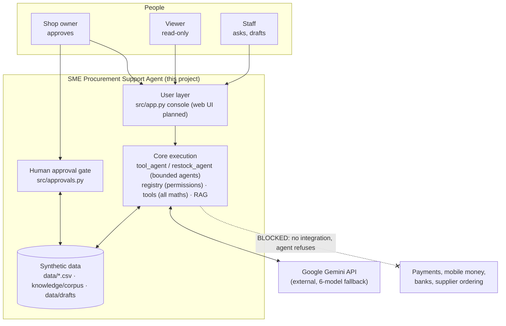

# System Context Diagram (Week 1, updated for the MVP)

Consolidated 2026-10-06 from the Week 1 architecture description (layered: user layer → human approval
gate → core execution → data, with a blocked boundary to payments and supplier ordering).

| Boundary | Rule |
|:---|:---|
| Gemini API | Receives only synthetic data and tool results; no keys or personal data |
| Approval gate | Only people decide; the AI has no route to it |
| Payments / ordering | Out of scope; nothing in the system can reach them |

Detailed views: `architecture-week3-rag.md`, `architecture-week4.md`, `architecture-week5.md`.
